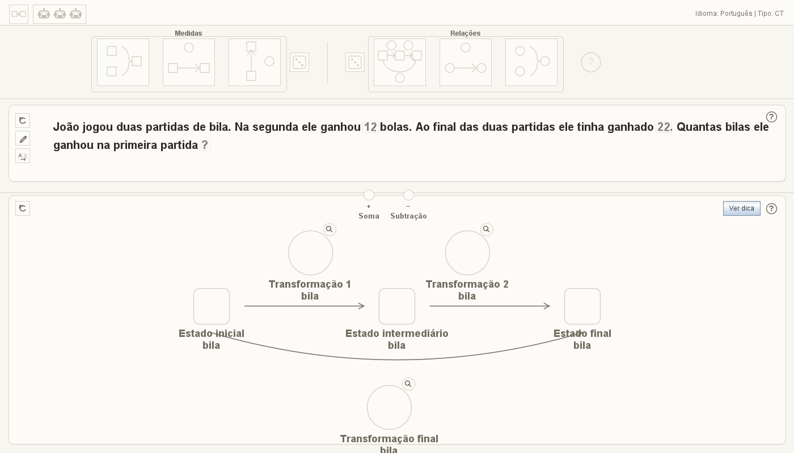
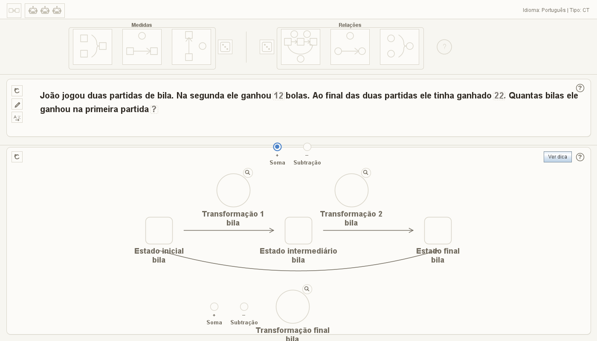
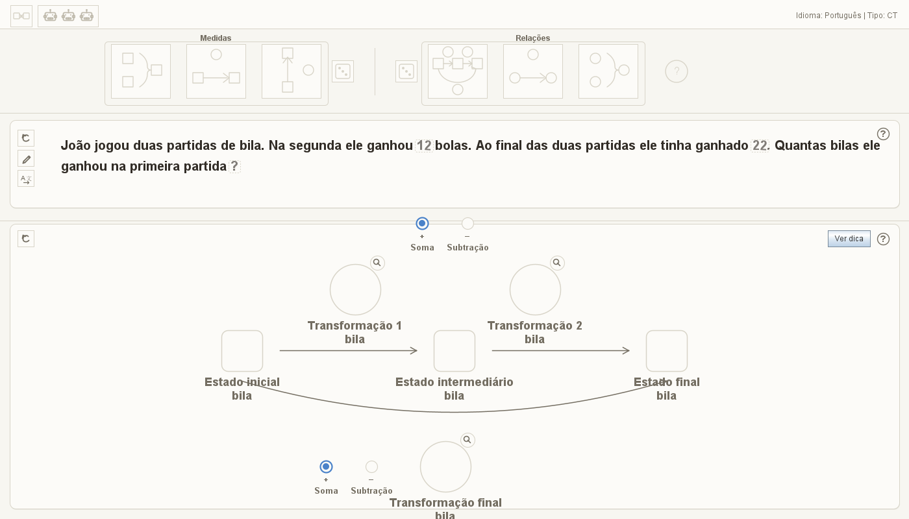

# P2.1 — validação visual de Composição de Transformações

Data: 2026-08-24

## Escopo

A validação protege a versão arquitetural atual sem recalcular nem completar
dados da curadoria humana. O catálogo canônico ainda não possui uma única
situação validada com `estado_intermediario` e
`operacao_estado_transformacao` simultaneamente preenchidos. Por isso, foram
usadas literalmente duas situações já curadas:

- `PO_TRANSFORMACAO_COMPOSTA_DOIS_PASSOS_guloseimas_400916186`, cujo
  `estado_intermediario` é `33`;
- `PO_COMPOSICAO_TRANSFORMACOES_bolas_509261012`, cuja
  `operacao_estado_transformacao` é `soma` e cuja primeira operação também é
  `soma`.

O harness não funde as linhas, não associa personagens por posição e não
inventa uma situação híbrida. Cada campo é validado em sua situação
proprietária; a segunda linha é usada para exercitar a interface porque é a
situação curada que possui as duas operações.

## Contratos verificados

1. O repositório lê literalmente os dois campos novos nas colunas 36 e 37 do
   esquema canônico de 37 colunas.
2. Composição de Transformações materializa seis elementos semânticos: três
   transformações e três estados.
3. O seletor entre transformações deriva sua posição das duas transformações
   superiores e permanece acima delas.
4. O seletor entre estado inicial e transformação resultante deriva sua
   posição da transformação resultante e permanece à esquerda dela.
5. Nenhum botão dos seletores se sobrepõe a um elemento do diagrama.
6. O segundo seletor não aceita clique antes do acerto do primeiro.
7. O segundo seletor só é apresentado após o acerto do primeiro.
8. A porta de conclusão das operações permanece fechada até as duas respostas
   corretas.
9. Cada resposta correta recebe o feedback azul do Gérard; o segundo seletor
   não recebe sucesso antecipado.

## Evidências visuais

### Antes da primeira operação

Somente o seletor entre as duas transformações está visível.

### Depois da primeira operação

A primeira operação está azul e o seletor final passa a ser apresentado à
esquerda da transformação resultante.

### Depois das duas operações

As duas escolhas curadas foram respondidas corretamente e ambas estão azuis.

## Automação e regressão

- novo harness: `tests/java/TesteVisualComposicaoTransformacoesP2_1.java`;
- harness gráfico legado `TesteInicializacaoSemCategoria` alinhado ao código
  canônico de idioma `pt-BR`;
- compilação da aplicação: 472 fontes, aprovada;
- compilação dos testes: 85 testes Java, aprovada;
- testes automáticos executados: 81 aprovados, nenhum reprovado;
- teste gráfico legado corrigido: executado separadamente e aprovado;
- verificador arquitetural integral: aprovado, nenhuma falha.

Não houve alteração em código de produção nem nos dados curados.
