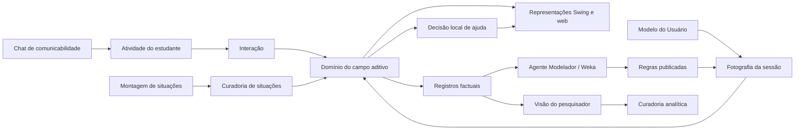

# Levantamento dos módulos funcionais do Gérard

**Data do levantamento:** 10 de setembro de 2026  
**Base examinada:** código Java/Swing, serviços de aplicação, servidor HTTP, cliente React, recursos, documentação arquitetural e testes do repositório.

## 1. Visão geral

O Gérard está organizado em torno de uma atividade de modelagem de situações-problema do campo aditivo. O núcleo semântico é compartilhado, enquanto Swing e web são apresentações distintas. A organização funcional atual pode ser compreendida em 15 módulos. Alguns correspondem a telas destinadas a um ator; outros prestam serviços transversais necessários à atividade, à pesquisa e à adaptação.

| Nº | Módulo funcional | Usuário ou ator principal | Situação atual |
|---:|---|---|---|
| 1 | Atividade do estudante | Estudante | Operacional no desktop; migração funcional para web em andamento |
| 2 | Edição e diferenciação semântica do texto | Estudante/pesquisador | Operacional em incrementos no desktop e na web |
| 3 | Montagem/autoria de situações | Professor, autor ou pesquisador | Operacional no desktop |
| 4 | Curadoria de situações | Pesquisador/curador | Operacional no desktop |
| 5 | Domínio do campo aditivo | Sistema e demais módulos | Núcleo compartilhado e ativo |
| 6 | Representações e visualização da atividade | Estudante | Swing e web possuem materializadores próprios |
| 7 | Interação e sincronização | Estudante/sistema | Ativo; parte ainda é adaptada por `Main.java` |
| 8 | Scaffolding e ajuda adaptativa | Estudante e Agente Modelador | Operacional em parte; arquitetura-alvo em migração incremental |
| 9 | Mensagens de comunicabilidade e chatbot | Estudante | Chat determinístico, sem LLM e sem Weka |
| 10 | Modelo do Usuário e sessão | Estudante/sistema | Persistência e fotografia de login implementadas; API web recém-integrada |
| 11 | Serviços de dados da pesquisa | Sistema/pesquisador | Coleta e controle de qualidade internos; replay como ferramenta de pesquisa |
| 12 | Visão e análise do pesquisador | Pesquisador | Operacional no desktop |
| 13 | Aprendizagem de máquina e publicação de regras | Agente Modelador/pesquisador | PART e Apriori implementados; publicação é editorial e explícita |
| 14 | Interpretação linguística e base de conhecimento | Sistema/curador | Implementado, com responsabilidades parcialmente históricas |
| 15 | Portabilidade web e API semântica | Estudante/sistema | Em desenvolvimento ativo |

## 2. Módulos

### 2.1 Atividade do estudante

É o módulo central de uso. Apresenta o enunciado, permite escolher/classificar uma categoria aditiva, construir o diagrama de Vergnaud, manipular representações complementares, informar a incógnita, receber feedback e avançar entre situações.

Abrange as seis famílias atuais: composição de medidas, transformação de medidas, comparação de medidas, composição de transformações, transformação de relação e composição de relações.

Principais componentes:

- `Main.TelaGerard`, ainda responsável por parte relevante da coordenação Swing;
- `gerard.dominio.atividade` e `gerard.dominio.campoaditivo`, que constituem ações e avaliações semânticas;
- `gerard.aplicacao.feedback` e `gerard.aplicacao.adaptacao`;
- no navegador, `App.tsx`, `EnunciadoInterativo.tsx`, `EdicaoValorFigura.tsx` e `EscolhaSinalFigura.tsx`.

### 2.2 Edição e diferenciação semântica do texto

Trata o enunciado como uma representação linguística manipulável. O participante pode editar, retirar, inserir e reorganizar segmentos do texto, enquanto o sistema preserva a identidade, a ordem e a classe semântica de cada fragmento. Entre as classes estão quantidades, incógnita, palavras comuns e **candidatos a organizadores da informação**.

A motivação empírica informada pela pesquisadora é que organizadores da informação presentes no discurso dos participantes estiveram associados a respostas corretas nos dados do estudo. O sistema deve registrar essa associação como evidência de pesquisa. Ela não autoriza concluir causalidade nem classificar automaticamente qualquer palavra como responsável pelo acerto.

Principais componentes:

- cena narrativa portátil produzida por `GeradorCenaDiagramaAditivo.gerarCenaNarrativa` e transportada por `CenaDiagramaAditivo`;
- materialização Swing coordenada por `Main.TelaGerard` e materialização web em `EnunciadoInterativo.tsx`/`EditorNarrativa.tsx`;
- `TipoSegmentoNarrativo.CANDIDATO_ORGANIZADOR_INFORMACAO`;
- `VocabularioTextoNarrativo` e a projeção portátil do vocabulário;
- `ControladorEditorNarrativa`, `RenderizadorEditorNarrativa` e `PecaPalavraRascunho`;
- na web, `EditorNarrativa.tsx` e `EnunciadoInterativo.tsx`.

O termo **candidato** é relevante: a classificação oferecida pela representação não deve se tornar, sozinha, um diagnóstico cognitivo do participante. A curadoria humana, os registros do discurso e a análise do pesquisador continuam sendo fontes distintas.

### 2.3 Montagem e autoria de situações

Permite construir um enunciado a partir de um diagrama preenchido, organizar blocos/palavras e preparar uma situação candidata. O fluxo docente de geração textual deve permanecer rastreado a situações curadas; uma candidata não se torna validada automaticamente.

Principais componentes:

- aba `Montagem` criada por `Main.java`;
- `gerard.campoaditivo.montagem`;
- editor narrativo em `gerard.ui.enunciado.editor`;
- serviços de narrativa e vocabulário em `gerard.campoaditivo.diagrama.modelo`.

### 2.4 Curadoria de situações

É a fronteira humana que revisa e promove situações. Permite editar dados, categoria, valores, papéis, sinais, traduções e narrativa rica; valida consistência e registra falhas de curadoria. A marcação “validada” é editorial, não resultado automático de um classificador.

Principais componentes:

- aba `Curadoria` e `TelaCuradoriaSituacoes`;
- `gerard.campoaditivo.curadoria` e `gerard.campoaditivo.curadoria.sinal`;
- `RepositorioSituacoesAditivas`, `ValidadorTraducaoCurada` e `RegistroErrosCuradoria`;
- `RepositorioCuradoriaNarrativaRica`, com sidecars XML.

Persistência principal:

- catálogo-base `situacoes_vergnaud.tsv`;
- catálogo promovido no diretório do usuário `situacoes_vergnaud_curadas.tsv`;
- auditoria e erros de curadoria em TSV;
- narrativas ricas em XML.

### 2.5 Domínio do campo aditivo

É a fonte única do significado matemático. Mantém identidades, papéis quantitativos, relações estruturais, incógnita original, valores, domínios numéricos, validações e registros factuais das ações constituídas. Não contém pixels, Swing, React ou gestos de mouse.

Principais componentes:

- `gerard.dominio.campoaditivo`;
- `PapelQuantitativo`, `IncognitaQuantitativa` e fábricas de papéis;
- relações estruturais de composição, transformação e comparação;
- `gerard.semantica`, que fornece tipos de contexto, papel, quantidade, número, pista e situação;
- serviços em `gerard.campoaditivo.servico`, `semantica`, `conclusao` e `transformacao`.

### 2.6 Representações e visualização da atividade

Materializa o mesmo estado semântico em texto, diagrama de Vergnaud e representações complementares, como Venn, quadradinhos e gráfico/eixo de inteiros. O termo “visualização” aqui significa a representação usada pelo estudante; as visualizações analíticas do pesquisador pertencem ao módulo 11.

Há dois caminhos de cena deliberadamente separados:

- **Cena compartilhada produzida no Java:** `GeradorCenaDiagramaAditivo` cria `CenaDiagramaAditivo`, com figuras, conectores, viewport e metadados semânticos;
- **Swing:** `RenderizadorSwingDiagramaAditivo` materializa a cena com Java2D/Swing;
- **Web:** `GeradorCenaGerard`, `FiguraCenaGerard` e `ConectorCenaGerard` materializam o contrato em SVG/React.

A equivalência entre plataformas é semântica: identidades, valores, relações, decisões e eventos. Não se exige igualdade de pixels.

### 2.7 Interação e sincronização entre representações

Traduz arrastar, soltar, clicar, editar, escolher sinal e manipular eixos em comandos semanticamente identificados. Mantém texto, Vergnaud e representação complementar coerentes após alterações.

Principais componentes:

- `gerard.interacao`, com submódulos de arraste, texto, eixo e geometria;
- `EstadoSemanticoCompartilhado` e `CoordenadorSincronizacaoRepresentacoes`;
- capturadores, projetores e destinos em `gerard.campoaditivo.sincronizacao.representacoes`;
- adaptadores Swing em `gerard.ui.vergnaud`;
- redutor `estadoRepresentacoes.ts` no cliente web.

O estado semântico pertence ao domínio. A amostragem física de ponteiro e a geometria pertencem à interação/representação.

### 2.8 Scaffolding e ajuda adaptativa

Reúne apoios pedagógicos e mecanismos de interação oferecidos durante a resolução. O repertório operacional atual inclui questionamento, feedback multissensorial, automatização de passos, material concreto, gráfico/eixo de inteiros, pickup, aproximação/atração e conclusão.

Principais componentes:

- `gerard.Scaffolding` e seus subpacotes;
- `gerard.aplicacao.adaptacao`;
- `IncognitaQuantitativa` e outros proprietários semânticos com repertórios locais;
- `MaterializadorDecisaoAjudaSwing` e materializadores de feedback.

Na arquitetura-alvo, o Agente Modelador aprende e publica regras; o proprietário semântico escolhe uma ajuda dentro do próprio repertório; a interface apenas materializa a decisão. `AgenteMonitor` e `AgenteZDP` aparecem em fluxos históricos/legados e estão sendo retirados de forma incremental, sem remoção em massa.

### 2.9 Mensagens de comunicabilidade e chatbot

Atende dúvidas operacionais e ações neutras observadas nos experimentos: uso do modelo, entrada de dados, pedido de esclarecimento, pedido de ajuda, retorno e transição. É deliberadamente separado do scaffolding pedagógico.

Principais componentes:

- desktop: `DialogoChatbotGerard` e `MensagensComunicabilidadeChatbot`;
- web: `ChatbotGerard.tsx` e `mensagensComunicabilidade.ts`.

O chatbot atual é determinístico. Não utiliza LLM nem Weka. Suas mensagens orientam o uso da interface e não avaliam a matemática nem selecionam apoio adaptativo.

### 2.10 Modelo do Usuário e sessão

Armazena perfil do aluno, perfil de aprendizagem, níveis de tarefas, partes do conhecimento/fases e diagnósticos de tarefas. Nome, idade, sexo, mídia preferida e escolaridade são dados cadastrais; mídia preferida é uma escolha única.

Principais componentes:

- `ModeloUsuario`, `PerfilAluno`, `PerfilAprendizagem` e `DiagnosticoTarefa`;
- `RepositorioModeloUsuario`;
- projeções imutáveis em `gerard.adaptacao.modelousuario`;
- `SessaoAdaptativaUsuario`, que cria uma fotografia estável no login;
- `DialogoUsuario` no Swing e tela equivalente no React.

Persistência:

- `~/Gerard/perfis_usuario.tsv`;
- `~/Gerard/diagnosticos_tarefa.tsv`;
- fotos em `~/Gerard/fotos/`.

Na web, `GET/POST /api/usuarios` lista e cadastra; `POST /api/sessao/usuario` inicia a sessão e congela a fotografia. A preferência cadastral pode orientar a forma de apresentação de uma ajuda já decidida, mas não decide sozinha se haverá ajuda.

### 2.11 Serviços de dados da pesquisa

Reúne capacidades internas de coleta e controle da qualidade dos dados, além da ferramenta de reprodução de sessões usada pelo pesquisador. Não constitui uma tela diretamente percebida pelo estudante. Distingue gesto físico, ação instrumental, decisão de ajuda, feedback exibido e hipótese analítica. Uma ação semanticamente constituída conserva um único `action_id`.

Principais componentes:

- `LoggerInteracaoGerard` para ações e eventos da atividade;
- `LoggerGestosInteracaoGerard` para gestos observáveis;
- `gerard.pesquisador.auditoria` e `gerard.pesquisador.analiseunidade`;
- `gerard.pesquisador.replay`, com protocolos reais e episódios sintéticos identificados como tais;
- `RepositorioArtefatosExplicativos` para explicações posteriores à tentativa.

Persistência inclui arquivos de sessão em `~/Gerard/logs/`, diagnósticos, artefatos explicativos e unidades de análise. Eventos factuais não são convertidos automaticamente em esquemas, conceitos-em-ação ou invariantes operatórios.

### 2.12 Visão e análise do pesquisador

Oferece uma janela separada para observar e analisar dados sem alterar a atividade do estudante. Possui sínteses, tabelas do estudo, ações neutras, distribuições por problema, grupos qualitativos, visualizações, Modelo do Usuário e curadoria do nível conceitual.

Principais componentes:

- `TelaVisaoPesquisador`;
- `PainelAtividadeModelador`;
- `gerard.pesquisador.visualizacao`, incluindo serialização e painel D3;
- `TelaArtefatoExplicativo` e curadoria humana de explicações/invariantes.

O pesquisador pode confirmar ou corrigir classificações analíticas. Palpites automáticos de nível conceitual permanecem sinais fracos até curadoria humana.

### 2.13 Aprendizagem de máquina e publicação de regras

Pertence ao Agente Modelador. Transforma diagnósticos acumulados em datasets, executa PART e Apriori pelo Weka, persiste resultados experimentais e permite publicação editorial de regras explicáveis.

Principais componentes:

- `AgenteModelador`;
- `InferenciaRegrasModelador`;
- `RepositorioRegrasInferidas`;
- `RepositorioRegrasAdaptativasPublicadas`;
- `ContadorMineracao` e auditorias de inserção/incorporação.

Fluxo:

1. objetos/relações do domínio produzem avaliação e diagnóstico factual;
2. o Modelador armazena casos idempotentes;
3. PART induz regras de classificação e Apriori minera associações;
4. resultados nascem experimentais;
5. publicação explícita produz regras versionadas e elegíveis apenas em login posterior;
6. proprietários semânticos aplicam as regras publicadas localmente.

O Weka não participa do chatbot, não avalia cliques e não escolhe diretamente uma mensagem de ajuda.

### 2.14 Interpretação linguística e base de conhecimento

Interpreta enunciados, símbolos, números e papéis para apoiar classificação e montagem da situação. Também lê bases JSONL de regras de domínio, pedagógicas, de entrevistas e experimentais.

Principais componentes:

- `gerard.interpretacao`, dividido em classificação, incógnita, modelo, regras, serviço e símbolo;
- `gerard.agente.conhecimento`;
- `CarregadorExemplosSituacaoVergnaud`, classificadores e resolvedores de papéis;
- recursos JSON/JSONL e TSV de exemplos.

Regras experimentais J48/PART e Apriori da base de conhecimento não substituem relações formais do domínio nem regras adaptativas publicadas.

### 2.15 Portabilidade web e API semântica

Transporta estados e comandos do domínio Java para uma apresentação React. O JSON é contrato de transporte, não uma segunda fonte matemática.

Principais componentes:

- `gerard.aplicacao.portabilidade`, com projetores, ações disponíveis e serviços por categoria;
- `ServidorPrototipoWeb`;
- `web-poc/src/api.ts` e `contratos.ts`;
- componentes React de atividade, cena, chat e usuário.

Estado atual:

- API funcional para situação, classificação, posicionamento, sinal, material concreto, ajuda contextual e usuários;
- seis serviços de atividade correspondentes às famílias do campo aditivo;
- cena web própria, derivada do contrato produzido pelo servidor;
- cadastro e login persistidos pelo servidor;
- interface e equivalência com o desktop ainda em desenvolvimento.

## 3. Camadas transversais

Algumas áreas dão suporte a todos os módulos e não devem ser tratadas como módulos autônomos de decisão:

- **internacionalização:** `gerard.i18n`, `gerard.idioma` e arquivos `mensagens_*.properties`;
- **identidade visual:** `UITemaGerard`, componentes Swing e tokens CSS equivalentes;
- **geometria:** layouts e descritores por representação; coordenadas não pertencem ao domínio;
- **infraestrutura:** arquivo, HTTP, JSON, TSV e XML apenas transportam ou persistem conhecimento produzido por seus proprietários;
- **suporte:** relato de bugs e preparação de contato.

## 4. Relações entre os módulos

## 5. Situação arquitetural e pontos de atenção

1. **`Main.java` ainda concentra coordenação Swing.** Extrações já moveram várias regras para domínio e aplicação, mas interação, representação e ciclo de tela continuam parcialmente acoplados.
2. **Desktop e web têm ritmos diferentes.** O desktop possui mais telas de pesquisador, montagem e curadoria; a web está concentrada na atividade do estudante, chat, usuário e API.
3. **A arquitetura adaptativa está em migração.** O Agente Modelador é o único agente da arquitetura-alvo. Monitor e ZDP ainda aparecem como legado em fluxos não migrados.
4. **Há duas classes de visualização.** Representações pedagógicas do estudante e gráficos analíticos do pesquisador devem permanecer separadas.
5. **Mensagens de comunicabilidade são independentes do scaffolding.** O chat orienta a operação; scaffolding apoia a resolução e depende de decisão pedagógica.
6. **Curadoria é autoridade editorial humana.** Classificação ou geração automática pode produzir candidatas, nunca promover silenciosamente uma situação ou regra.
7. **Registros têm granularidades distintas.** Gestos, ações instrumentais, decisões, exibições e hipóteses não devem ser consolidados em um log sem distinção.
8. **Persistências atuais são locais e baseadas em arquivo.** O servidor web usa os mesmos repositórios de perfil; outros módulos ainda possuem arquivos TSV, JSONL e XML próprios.

## 6. Mapa físico resumido

O levantamento encontrou 580 classes Java sob `src/gerard`, distribuídas principalmente em:

| Pacote superior | Classes Java | Papel predominante |
|---|---:|---|
| `campoaditivo` | 163 | modelo, curadoria, cenas, sincronização e representações específicas |
| `dominio` | 74 | entidades, papéis, relações e ações semanticamente constituídas |
| `pesquisador` | 48 | análise, auditoria, replay e visualização |
| `semantica` | 47 | vocabulário e tipos semânticos reutilizáveis |
| `ui` | 46 | apresentação Swing |
| `Scaffolding` | 37 | mecanismos de apoio e feedback |
| `interpretacao` | 36 | interpretação linguística e simbólica |
| `agente` | 35 | conhecimento, Modelo do Usuário e Modelador |
| `aplicacao` | 34 | casos de uso, adaptação, feedback e portabilidade |
| `interacao` | 24 | protocolos de gesto e interação |
| `adaptacao` | 23 | fotografia, projeções e sessão adaptativa |
| demais | 13 | idioma, i18n, estilo, suporte e infraestrutura web |

Há 139 fontes de teste Java. A classificação nominal dos testes mostra cobertura explícita para web, curadoria, Modelo/ML, representação e registro/replay, além de testes transversais de domínio e integração.

## 7. Proposta de agrupamento para documentação futura

Para navegação por funcionalidades, a documentação pode ser organizada em cinco áreas maiores:

1. **Experiência de aprendizagem:** estudante, edição semântica do texto, representações, interação, scaffolding e comunicabilidade.
2. **Conteúdo:** montagem, curadoria, interpretação e catálogo de situações.
3. **Adaptação:** Modelo do Usuário, sessão, Agente Modelador e regras publicadas.
4. **Pesquisa:** registros, auditoria, replay, artefatos explicativos e visualizações.
5. **Plataformas:** núcleo semântico, Swing, API e cliente web.

Esse agrupamento é apenas uma visão de navegação. Ele não transfere a propriedade do conhecimento: relações matemáticas continuam no domínio, seleção de ajuda nos proprietários semânticos, aprendizagem no Modelador, curadoria no pesquisador e materialização nas interfaces.
